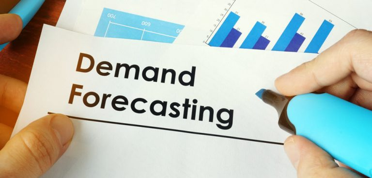
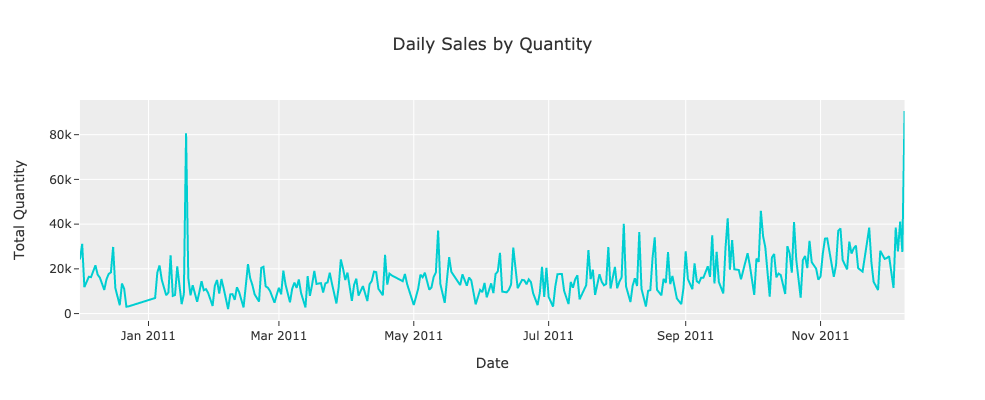
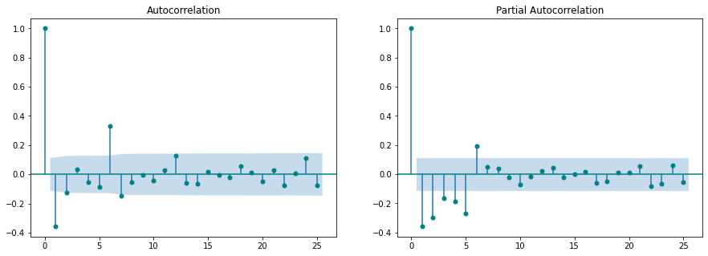
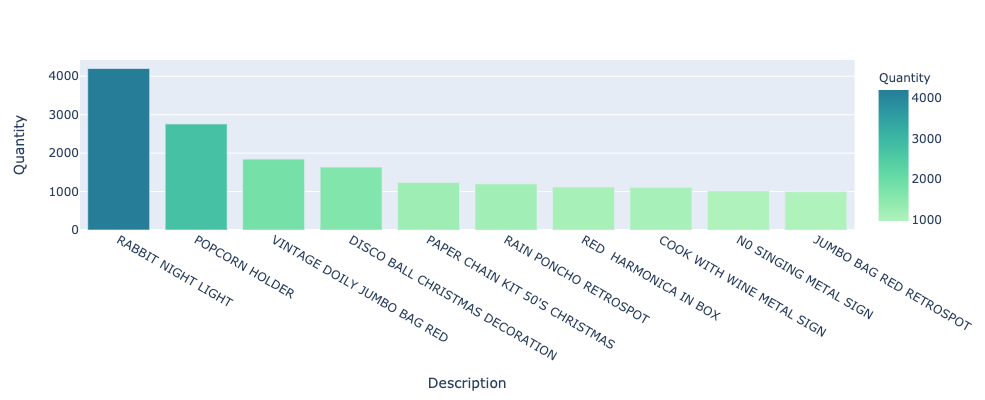
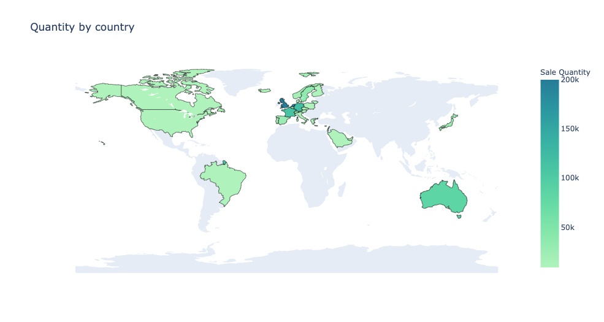

# Online Retail Sales Time Series Analysis & Forecasting


## Challenge

An online retail store is interested in maintaining the right inventory given its historical sales. Build a model that predicts sales quantities for the 7 days from 11/27/2011 - 12/3/2011 Sun - Sat. To help the company prepare for the worst case, we will focus ourr predictions and the evaluation of our model on only the top three selling items.

We define top selling items as items which had the greatest total sales over this
week across all countries.

## Data Overview
This is a public, transnational data set on transactions from 12/01/2010 and 12/09/2011 for a UK-based and registered non-store online retail company.

**Columns:**
```
- InvoiceNo: Invoice number. Nominal, a 6-digit integral number uniquely assigned to each transaction. If this code starts with letter 'c', it indicates a cancellation.
- StockCode: Product (item) code. Nominal, a 5-digit integral number uniquely assigned to each distinct product.
- Description: Product (item) name. Nominal.
- Quantity: The quantities of each product (item) per transaction. Numeric.
- InvoiceDate: Invice Date and time. Numeric, the day and time when each transaction was generated.
- UnitPrice: Unit price. Numeric, Product price per unit in sterling.
- CustomerID: Customer number. Nominal, a 5-digit integral number uniquely assigned to each customer.
- Country: Country name. Nominal, the name of the country where each customer resides.
```


Source: http://archive.ics.uci.edu/ml/machine-learning-databases/00352/

## Steps

1. Data Wrangling and Exploratory Data Analysis
2. Feature Engineering and Selection
3. Modeling and forecasting
4. Model evaluation and validation
5. Sales quantity forecast results and visualization
6. Final results and analysis report

## Models under evaluation
- ARIMA/SARIMA
- Naïve forecast
- Prophet
- LSTM

## EDA 



Seems like the data is non-stationary and has some spike in sales in Feb and end of Nov in this dataset. 



 
After some data wrangling, I found the top three selling items that we defined as items which had the greatest total sales over the week from 11/27/2011 - 12/3/2011 across all countries. 

Here were the top 10 items:



The data is primarily from UK shown in the map below:




